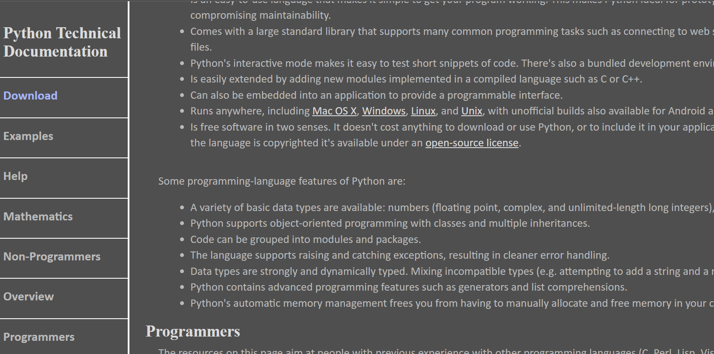

# technical-documentation

A webpage that recreates documentation for python.

**Live-Demo:** [https://oendemann.github.io/technical-documentation/#Programmers]

---

---

## About The Page 

A simple webpage that redesigns some python technical documentation as found at https://wiki.python.org/moin/BeginnersGuide for a freeCodeCamp project per the responsive web design course requirements. Also per requirements, I implemented code elements as found from https://oxylabs.io/blog/python-syntax-errors, and created different responsive features, such as navbar redesign for different resolutions and link behaviors.

---

## Built With

* **HTML:** Used to create the bones of the website (text, meta info, link placements and behaviors, etc).
* **CSS:** Used for the overarching design of the website, including background-color, navbar behavior, positioning, and more.

---

## What I Learned

1. If code becomes unorganized, it can be difficult to understand which behaviors are effecting which elements in specific ways. Commenting away specific elements in CSS when designing new features proved to be helpful, but creating a new branch would have probably been the right choice.
2. New elements and their included behavior, such as pre and code, as well as new CSS syntax like white-space.

## Acknowledgments

* Project idea and requirements from [freeCodeCamp.org](https://www.freecodecamp.org/)
* Text taken directly from [oxylabs.io]https://oxylabs.io/blog/python-syntax-errors for the "Common Syntax Errors" section.
* Text taken directly from [wiki.python.org]https://wiki.python.org/moin/BeginnersGuide for all other sections.